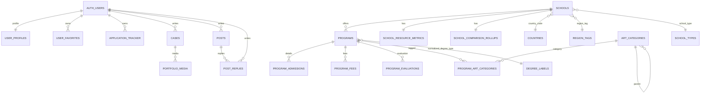

# Supabase Database Analysis - Artsee / Artiqore

采集时间：2026-05-12（Asia/Shanghai）

项目：`yijianxin`
Project ref：`nufrgmlhlfmhxsqbybfd`
Region：`ap-northeast-1`
状态：`ACTIVE_HEALTHY`
Postgres：17.6
数据库总大小：约 19 MB

> 本报告基于 Supabase MCP 只读查询、Supabase Advisor、仓库迁移文件和 `web/app/api` / Flutter 调用代码交叉分析。报告刻意不展开手机号、验证码、Auth 用户明细等敏感数据。

## 1. Executive Summary

数据库整体已经具备一个可用的艺术留学产品数据骨架：学校、项目、录取要求、费用、评估、艺术分类、社区/案例、用户资料和收藏/申请追踪都有表。核心数据量不大，适合继续快速迭代：`schools` 212 行，`programs` 618 行，项目卫星表各约 614 行。

最关键问题不是容量，而是三类一致性风险：

1. **安全风险**：`sms_verifications`、`auth_provider_links`、`likes`、`portfolio_media` 在 `public` schema 且未启用 RLS；`sms_verifications.verification_code` 被 Supabase Advisor 判定为敏感列暴露。另有 `docs/SETUP_DATABASE.md` 包含 service role key，应立即从仓库历史和当前文件中移除并轮换密钥。
2. **代码-数据库漂移**：当前库没有 `community_posts`、`schools.country`、`schools.qs_art_rank`、`programs.degree_type`、`user_profiles.has_completed_onboarding`、`user_profiles.interested_categories`；但 Web、Flutter、测试和文档中仍大量引用。部分页面/API 会直接失败。
3. **类型漂移**：当前 `schools.id`、`programs.id`、`programs.school_id` 是 UUID；但 `web/lib/supabase/types.ts`、`web/app/api/v1/programs/[id]/route.ts`、`web/app/explore/[id]/page.tsx` 等仍按 `number` / `parseInt` 处理。

优先级建议：先修安全与密钥，再统一 schema 契约，最后做索引/RLS 性能整理。

## 2. Current Public Schema Inventory

| 表 | 行数 | RLS | 大小 | 业务定位 |
|---|---:|---|---:|---|
| `program_art_categories` | 3174 | on | 368 kB | 项目与艺术分类多对多 |
| `programs` | 618 | on | 1800 kB | 专业/项目主表 |
| `program_admissions` | 614 | on | 600 kB | 作品集、语言、截止日期等录取要求 |
| `program_fees` | 614 | on | 304 kB | 学费与币种 |
| `program_evaluations` | 614 | on | 872 kB | 申请难度、竞争度、证据来源 |
| `school_resource_metrics` | 213 | on | 880 kB | 学校资源、设施、奖学金等指标 |
| `schools` | 212 | on | 1104 kB | 院校主表 |
| `school_comparison_rollups` | 209 | on | 96 kB | 学校聚合对比指标 |
| `countries` | 180 | on | 96 kB | 国家字典 |
| `art_categories` | 111 | on | 136 kB | 艺术分类字典，支持父子层级 |
| `degree_labels` | 59 | on | 64 kB | 标准化学位字典 |
| `currencies` | 51 | on | 48 kB | 币种字典 |
| `cases` | 9 | on | 32 kB | 录取案例 |
| `home_contents` | 9 | on | 80 kB | 首页内容管理 |
| `region_tags` | 9 | on | 64 kB | 地区标签 |
| `posts` | 8 | on | 32 kB | 论坛/问答帖 |
| `school_types` | 7 | on | 32 kB | 学校类型字典 |
| `user_profiles` | 4 | on | 128 kB | Auth 用户资料扩展 |
| `auth_provider_links` | 1 | off | 80 kB | 第三方登录绑定 |
| `sms_verifications` | 1 | off | 56 kB | 短信验证码 |
| `application_tracker` | 0 | on | 16 kB | 用户申请追踪 |
| `likes` | 0 | off | 24 kB | 点赞关系 |
| `portfolio_media` | 0 | off | 16 kB | 案例作品集媒体 |
| `post_replies` | 0 | on | 16 kB | 帖子回复 |
| `user_favorites` | 0 | on | 24 kB | 用户收藏项目 |
| `user_follows` | 0 | on | 32 kB | 关注关系 |

## 3. Business Domain Model



当前建模方向是合理的：`schools` / `programs` 是核心内容主干，`program_*` 卫星表将申请要求、费用、评估拆出，避免项目主表过宽；`school_resource_metrics` 与 `school_comparison_rollups` 将学校展示指标和聚合指标拆出，适合后续做对比页。

需要注意的是，部分 “一对一” 语义没有用唯一约束保证：`program_admissions.program_id`、`program_fees.program_id`、`program_evaluations.program_id` 当前不是唯一索引，业务上看每个项目应最多一条。现在数据中 614/618 个项目有对应行，尚无重复，但建议补唯一约束或明确支持多版本。

## 4. Key Table Shape

### 4.1 School / Program

`schools` 当前核心字段：

- `id uuid primary key`
- `name_zh`, `name_en`
- `raw_country`, `country_code`, `region_tag`, `city`
- `school_type`, `school_tier`, `status`
- `qs_art_design_rank`, `qs_architecture_built_environment_rank`, `qs_overall_rank`, `qs_art_humanities_rank`, `qs_history_of_art_rank`
- `official_website`, `international_students_page`, `logo_url`, `campus_image_urls`
- `description`, `feature_tags`, `strength_disciplines`, `notable_alumni`

`programs` 当前核心字段：

- `id uuid primary key`
- `school_id uuid not null references schools(id)`
- `program_name`
- `raw_degree_type`, `normalized_degree_type`, `degree_full_name`
- `program_category`, `program_code`, `ucas_code`
- `duration_text`, `duration_months`, `study_mode`, `intake_months`
- `requires_portfolio`, `requires_interview`, `requires_personal_statement`
- `minimum_education`, `program_overview`, `program_highlights`, `core_courses`, `career_paths`
- `status`, `is_recommended`, `source_file`, `source_hash`

### 4.2 Admissions / Fees / Evaluations

`program_admissions`：

- `program_id uuid not null`
- 作品集：`portfolio_requirements`, `portfolio_format`, `portfolio_deadline`
- 语言：`ielts_overall`, `ielts_subscores`, `toefl_ibt`, `other_language_tests`
- 材料：`interview_format`, `reference_count`, `academic_requirements`
- 截止日期：`regular_deadline`, `priority_deadline`, `deadline_notes`

`program_fees`：

- `program_id uuid not null`
- `international_tuition_fee`, `domestic_tuition_fee`, `currency_code`, `additional_fees_note`

`program_evaluations`：

- `program_id uuid not null`
- `application_difficulty_score` smallint 1-5
- `competition_level`, `acceptance_rate`, `data_source`, `source_url`, `evidence_note`, `updated_by`

### 4.3 User / Community

`user_profiles`：

- `id uuid primary key references auth.users(id)`
- `nickname`, `avatar_url`, `phone`, `country_code`
- WeChat 绑定字段：`wechat_open_id`, `wechat_union_id`, `wechat_nickname`, `wechat_avatar_url`
- 用户属性：`user_type`, `role`, `status`, `is_verified`, `is_premium`
- 统计：`following_count`, `followers_count`, `artworks_count`, `favorites_count`

`posts` / `post_replies`：

- 帖子使用 `type`, `title`, `content`, `tags`, `like_count`, `answer_count`, `view_count`, `status`
- 回复表通过 `post_id` 关联 `posts`
- `post_replies` 插入后触发器会递增 `posts.answer_count`

`cases`：

- 录取案例字段包括 `undergrad`, `gpa`, `target_school`, `target_program`, `result`, `content`, `excerpt`, `tags`, 计数字段和匿名标记。

## 5. Data Quality Analysis

### 5.1 Coverage

| 检查 | 结果 |
|---|---:|
| 项目无学校 | 0 |
| 录取要求孤儿行 | 0 |
| 学费孤儿行 | 0 |
| 评估孤儿行 | 0 |
| 项目分类孤儿行 | 0 |
| 分类关联缺失分类 | 0 |
| 学校无项目 | 2 |
| 学校缺 `country_code` | 5 |
| 学校缺中文名 | 0 |
| 学校缺 `raw_country` | 0 |
| 项目缺标准化学位 | 4 |
| 项目缺录取要求行 | 4 |
| 项目缺学费行 | 4 |
| 项目缺评估行 | 4 |
| 项目有分类 | 601 / 618 |
| 学校有资源指标 | 212 / 212 |
| 学校有对比 rollup | 207 / 212 |

结论：核心关系完整性很好，孤儿行没有；缺口主要是少量学校国家编码、少量项目卫星数据和学校 rollup 未补齐。

### 5.2 Status Distribution

- `schools`: active 198, done 13, processing 1
- `programs`: active 606, draft 12
- `cases`: published 9
- `posts`: published 8
- `home_contents`: hero_banner 1, hot_hall 5, recent_exhibition 3
- `programs.requires_portfolio`: true 374, false 30, null 214

`requires_portfolio` 存在 214 个 null，虽然字段默认值是 false，但历史导入数据未回填。前端如果直接按 truthy/falsy 处理通常没问题，但筛选统计会混淆 “明确不需要” 和 “未知”。

### 5.3 Duplicate Candidates

英文名重复的学校有 3 组、6 行：

- `alberta university of the arts`: 阿尔伯塔艺术与设计大学 / 阿尔伯塔艺术大学
- `camberwell college of arts`: 伦敦艺术大学坎伯韦尔艺术学院 / 坎伯韦尔艺术学院
- `korea national university of arts`: 韩国国立艺术大学 / 韩国艺术综合学校

官网没有重复，项目同校同名同学位没有重复，项目-分类 pair 没有重复。

这些重复可能是合法别名，也可能是导入重复。建议加一个 `school_aliases` 或 `canonical_school_id` 机制，而不是简单删除。

### 5.4 Country / Region Semantics

`raw_country` 里混有国家和区域桶：

- 国家：英国、加拿大、南非、中国、意大利、日本等
- 美国区域桶：南方与西南、中西部旗舰、加州旗舰、东北强校
- 泛区域：其他欧洲国家、其他亚洲国家

这解释了为什么新增了 `country_code` 与 `region_tag`。建议后续 API 不再暴露 `country` 字段，而是返回：

- `country_code`
- `country_name_zh`（join `countries`）
- `region_tag`
- `raw_country` 作为兼容/展示字段

## 6. RLS / Security Analysis

Supabase Advisor 给出安全问题：

### 6.1 P0: RLS Disabled In Public

以下表在 exposed `public` schema 中未启用 RLS：

- `sms_verifications`
- `auth_provider_links`
- `likes`
- `portfolio_media`

其中 `sms_verifications` 含 `verification_code`，Advisor 判定为敏感列暴露。即使应用层只通过 service role 写入，只要 anon/authenticated 具备表权限且 RLS 关闭，就可能通过 PostgREST 被访问。

建议：

```sql
alter table public.sms_verifications enable row level security;
alter table public.auth_provider_links enable row level security;
alter table public.likes enable row level security;
alter table public.portfolio_media enable row level security;

-- sms/auth link 默认不暴露给客户端
create policy sms_no_client_access on public.sms_verifications for all using (false) with check (false);
create policy auth_links_no_client_access on public.auth_provider_links for all using (false) with check (false);

-- likes 至少限制本人管理；读策略按产品决定是否公开聚合
create policy likes_owner_select on public.likes for select using ((select auth.uid()) = user_id);
create policy likes_owner_insert on public.likes for insert with check ((select auth.uid()) = user_id);
create policy likes_owner_delete on public.likes for delete using ((select auth.uid()) = user_id);
```

### 6.2 P0: Service Role Key Exposure

仓库文件 `docs/SETUP_DATABASE.md` 包含 Supabase service role key 示例值。即使只是历史文档，也应视为泄露：

- 立即在 Supabase Dashboard 轮换 service role key
- 从当前文件中删除真实 key，只保留 `<your-service-role-key>`
- 如仓库已推送到远端，按密钥泄露流程处理 Git 历史

### 6.3 RLS Enabled But No Policy

以下表启用了 RLS 但没有策略：

- `school_resource_metrics`
- `school_comparison_rollups`

如果这些表需要被前端匿名读，用 anon key 直连会读不到；如果只通过 service role BFF 读，则没问题，但语义不清。建议补公开读策略或明确只服务端读取。

### 6.4 Public Profiles

`user_profiles` 有 `Public profiles are viewable by everyone`，而表中包含 `phone`、`wechat_*`、`role`、`last_login_at` 等字段。RLS 允许公开 select 全行时，PostgREST 客户端可能读到比“公开资料”更多的字段。

建议拆分：

- 保留 `user_profiles_private`
- 新建 `public_profiles` view，只暴露 `id`, `nickname`, `avatar_url`, `user_type`, `bio`, `location`, `is_verified`
- 客户端和公开页面只读 view

### 6.5 Function Search Path Mutable

以下函数未设置固定 `search_path`：

- `update_updated_at_column`
- `handle_new_user`
- `increment_case_like`
- `decrement_case_like`
- `increment_post_like`
- `decrement_post_like`
- `increment_post_answer_count`
- `art_categories_touch_updated_at`

建议统一改为 `security invoker` 默认函数加 `set search_path = public, pg_temp`；`handle_new_user` 若必须 `security definer`，也要固定 `search_path` 并 revoke public execute。

### 6.6 SECURITY DEFINER RPC Exposure

`handle_new_user()` 是 `SECURITY DEFINER`，Advisor 指出 anon/authenticated 可执行。它是 Auth trigger 用函数，不应通过 `/rest/v1/rpc/handle_new_user` 公开调用。

建议：

```sql
revoke execute on function public.handle_new_user() from anon, authenticated, public;
```

## 7. Performance Analysis

当前数据量很小，真实性能压力不大；Advisor 主要发现结构性问题。

### 7.1 Missing FK Indexes

Advisor 标出多个 FK 缺覆盖索引，重点建议补：

- `application_tracker(user_id)`
- `application_tracker(program_id)`
- `cases(author_id)`
- `posts(author_id)`
- `post_replies(post_id)`
- `post_replies(author_id)`
- `program_admissions(program_id)`
- `program_fees(program_id)`
- `program_evaluations(program_id)`
- `program_art_categories(program_id)`
- `user_favorites(program_id)`
- `portfolio_media(case_id)`
- `region_tags(implied_country_code)`

其中项目卫星表和帖子/回复相关索引最值得优先补，因为它们会直接支撑详情页 join 和用户主页。

### 7.2 Duplicate Index

`programs` 有重复索引：

- `idx_programs_school`
- `idx_programs_school_id`

两者都是 `programs(school_id)`。保留使用次数较高的 `idx_programs_school_id`，删除另一个即可。

### 7.3 RLS InitPlan

多条 RLS policy 使用 `auth.uid()`，Advisor 建议改成 `(select auth.uid())`，避免每行重复求值。涉及：

- `user_profiles`
- `user_favorites`
- `user_follows`
- `cases`
- `posts`
- `post_replies`

数据量小的时候无感，但以后社区内容多了会有帮助。

### 7.4 Multiple Permissive Policies

多个表有重复 SELECT policy：

- `home_contents`
- `programs`
- `school_types`
- `schools`
- `user_favorites`
- `user_follows`

建议合并重复策略，避免策略膨胀和维护混乱。

## 8. Storage

Storage bucket：

| bucket | public | 对象数 | 大小 |
|---|---|---:|---:|
| `avatars` | true | 6 | 269 kB |

策略：

- 公开读 `avatars`
- authenticated 用户只能在 `{user_id}/...` 前缀下插入、更新、删除

Advisor 警告：公开 bucket 有 broad SELECT policy，可能允许 listing。公开头像 URL 访问不一定需要允许列目录。建议限制 listing，或接受这一点但确认头像对象名不含敏感信息。

## 9. Migration / Repo Drift

### 9.1 Remote Applied Migrations

Supabase 远端迁移记录：

- `20260329210915_create_cases_posts_tracker_mentors`
- `20260329213103_increment_post_answers_trigger`
- `20260330200648_fix_fk_to_user_profiles_and_rls`
- `20260401010825_like_count_functions`

仓库当前 `supabase/migrations/`：

- `20260410120000_storage_avatars.sql`
- `20260411180000_community_posts.sql`
- `20260416010000_fix_onboarding_columns.sql`
- `20260423000000_home_contents.sql`

这说明迁移目录与远端迁移历史没有完整同步：远端有早期迁移但仓库没有；仓库有后续迁移但远端迁移表未记录，部分对象却存在（如 `avatars`, `home_contents`），部分对象不存在（如 `community_posts`, onboarding columns）。

建议把远端 schema dump 成 baseline migration，或用 Supabase CLI 做一次迁移历史 reconcile，否则后续环境重建会不可预测。

### 9.2 Missing Objects Referenced By Code

当前库检查结果：

| 代码/文档引用 | 当前库是否存在 | 影响 |
|---|---|---|
| `public.community_posts` | no | `/api/v1/community/posts` 会失败 |
| `schools.country` | no | 学校列表筛选、探索页、Flutter 学校展示会失败或缺字段 |
| `schools.qs_art_rank` | no | 排名筛选/展示会失败 |
| `programs.degree_type` | no | 项目列表筛选、探索页标签会失败 |
| `programs.id integer` | no, uuid | 按数字 id 的 API/页面会失败 |
| `programs.school_id integer` | no, uuid | API 参数校验和类型定义错误 |
| `user_profiles.has_completed_onboarding` | no | Flutter 冷启动判断、更新资料 API 会失败 |
| `user_profiles.interested_categories` | no | Flutter onboarding 写入会失败 |

### 9.3 High Impact Code References

- `web/app/api/v1/schools/route.ts` 使用 `country`、`qs_art_rank`，但实际应使用 `raw_country` / `country_code` 和 `qs_art_design_rank`。
- `web/app/api/v1/programs/route.ts` 使用 `degree_type`，但实际应使用 `raw_degree_type` 或 `normalized_degree_type`；还把 `school_id` 当整数。
- `web/app/api/v1/programs/[id]/route.ts` 对 UUID id 做 `parseInt`，会导致合法 UUID 被拒绝。
- `web/app/explore/page.tsx` select `schools(country, qs_art_rank)`，实际字段不存在。
- `web/app/explore/[id]/page.tsx` 对 program id 做 `parseInt`，并读取 `program.degree_type` / `school.country`。
- `web/app/api/v1/community/posts/**` 访问不存在的 `community_posts` 表。
- `app/lib/services/supabase_service.dart`、`app/lib/main.dart`、`app/lib/services/auth_service.dart` 使用不存在的 onboarding 字段。
- `web/lib/supabase/types.ts` 仍是旧 schema：`School.id: number`、`Program.id: number`、`degree_type`、`country`、`qs_art_rank` 等均与当前库不一致。

## 10. Product / API Implications

### 10.1 BFF Strategy Is Correct But Must Be Consistent

AGENTS.md 约定 Flutter 优先走 `web/app/api/v1/*`，敏感写操作放 Next Route Handler。这是正确架构，尤其可以避免 service role 进入 APP。

但当前 BFF 很多 route 使用 service role 做公开读，这会绕过 RLS。它本身不一定错，但要求 API 层必须严格做字段白名单、状态过滤和权限校验。现在 `select("*")` 较多，建议收紧：

- 公开列表：只 select 前端需要字段
- 用户资料 join：只暴露公开 profile 字段
- 管理端：必须 `requireAdmin`

### 10.2 API Contract Should Follow Current Schema

建议对外 JSON 做兼容映射，而不是让前端直接追数据库字段：

- `country`: API 可由 `raw_country` 或 `countries.name_zh` 映射生成
- `qs_art_rank`: API 可映射自 `qs_art_design_rank`
- `degree_type`: API 可映射自 `normalized_degree_type` 或 `raw_degree_type`

这样 Flutter 和 Web 不必立刻大改所有字段，但数据库仍保持更规范的 schema。

## 11. Recommended Fix Plan

### P0 - 立即处理

1. 轮换 Supabase service role key，并清理 `docs/SETUP_DATABASE.md` 中真实 key。
2. 给 `sms_verifications`、`auth_provider_links`、`likes`、`portfolio_media` 启用 RLS；尤其先封住 `sms_verifications`。
3. revoke `handle_new_user()` 对 anon/authenticated/public 的 execute 权限。
4. 决策 `community_posts`：要么执行迁移创建表，要么把 API 切回现有 `posts`。

### P1 - 本周处理

1. 修复 `web/lib/supabase/types.ts`，最好改为 `supabase gen types typescript` 生成。
2. 修复 UUID 路由：`programs/[id]`、`explore/[id]` 不要 `parseInt`。
3. 修复字段映射：`country` -> `raw_country` / `country_code`，`qs_art_rank` -> `qs_art_design_rank`，`degree_type` -> `normalized_degree_type` / `raw_degree_type`。
4. 执行 onboarding 迁移，补 `user_profiles.has_completed_onboarding` 与 `interested_categories`，或改 APP 不再依赖这两个字段。
5. 将项目卫星表的 `program_id` 补唯一约束或在业务上明确多行版本机制。

### P2 - 结构治理

1. 补 FK 索引，删除重复索引。
2. 合并重复 permissive policies。
3. 修复 RLS policy 中的 `auth.uid()` initplan。
4. 建 `public_profiles` view，避免公开暴露 `user_profiles` 全字段。
5. 做一次 migration baseline/reconcile，让远端和仓库一致。
6. 针对重复学校建立 canonical/alias 机制。

## 12. Suggested Migration Sketches

### 12.1 Onboarding Columns

```sql
alter table public.user_profiles
  add column if not exists has_completed_onboarding boolean default false,
  add column if not exists interested_categories text[] default '{}'::text[];
```

### 12.2 Public Read For School Rollups If Needed

```sql
create policy "public read school resource metrics"
on public.school_resource_metrics
for select
to anon, authenticated
using (true);

create policy "public read school comparison rollups"
on public.school_comparison_rollups
for select
to anon, authenticated
using (true);
```

### 12.3 FK Indexes

```sql
create index concurrently if not exists idx_application_tracker_user_id on public.application_tracker(user_id);
create index concurrently if not exists idx_application_tracker_program_id on public.application_tracker(program_id);
create index concurrently if not exists idx_cases_author_id on public.cases(author_id);
create index concurrently if not exists idx_posts_author_id on public.posts(author_id);
create index concurrently if not exists idx_post_replies_post_id on public.post_replies(post_id);
create index concurrently if not exists idx_post_replies_author_id on public.post_replies(author_id);
create index concurrently if not exists idx_program_admissions_program_id on public.program_admissions(program_id);
create index concurrently if not exists idx_program_fees_program_id on public.program_fees(program_id);
create index concurrently if not exists idx_program_evaluations_program_id on public.program_evaluations(program_id);
create index concurrently if not exists idx_program_art_categories_program_id on public.program_art_categories(program_id);
create index concurrently if not exists idx_user_favorites_program_id on public.user_favorites(program_id);
create index concurrently if not exists idx_portfolio_media_case_id on public.portfolio_media(case_id);
```

### 12.4 Drop Duplicate Index

```sql
drop index concurrently if exists public.idx_programs_school;
```

### 12.5 Generated Public Profile View

```sql
create or replace view public.public_profiles as
select
  id,
  nickname,
  avatar_url,
  user_type,
  bio,
  location,
  is_verified,
  created_at
from public.user_profiles
where status = 'active';
```

## 13. Validation Commands

After fixes:

```bash
npm run test:backend
npm run test:web
cd app && flutter test
```

注意：当前根目录缺 `.env`，`npm run test:backend` 默认只读根 `.env`，不会读取 `web/.env.local`。如果要跑通，需要在根目录配置 `SUPABASE_URL` 与 `SUPABASE_SERVICE_ROLE_KEY`，或改脚本兼容 `web/.env.local` 的 public URL 加 root service key。

## 14. Bottom Line

数据库本身不是“烂摊子”，更像是经历了几轮 schema 演进后，远端、迁移、Web 类型、Flutter 模型没有同步。数据规模健康，主关系完整；真正要紧的是先封住敏感表和泄露密钥，再统一字段契约。只要把 UUID/字段映射和 migration baseline 拉齐，这套 Supabase 可以继续支撑当前产品阶段。
